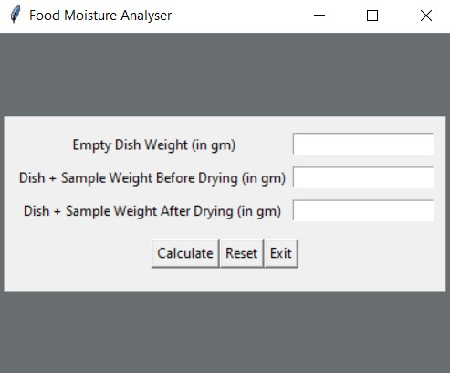
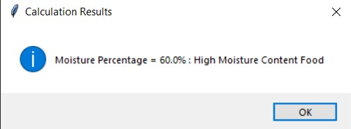

# Food-Moisture-Analyser

It is an application which helps to calculate and analyze the moisture content of food for industrial purpose.

## GUI
The basic GUI of the tool looks like this. 

## Working
Enter the appropriate values in the fields given.

After inserting values, click on calculate button below to calculate else reset or exit. On clicking calculate button a dialogue box will open with necessary outputs.

